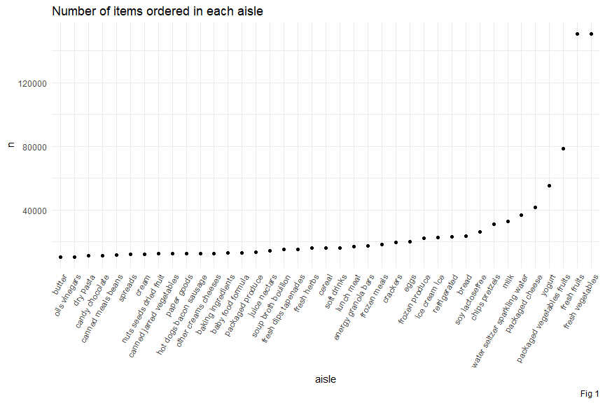
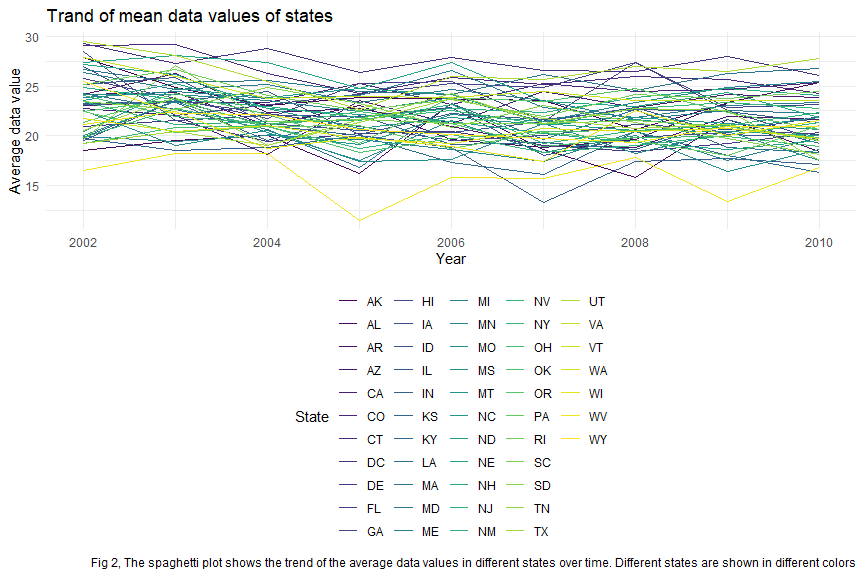
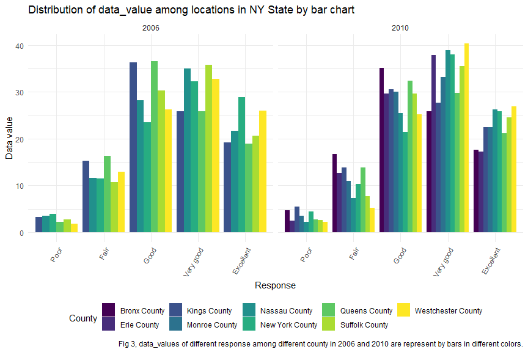
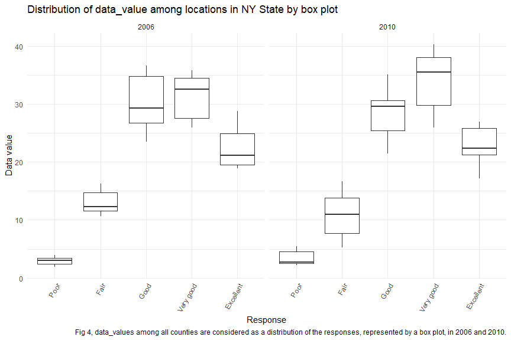
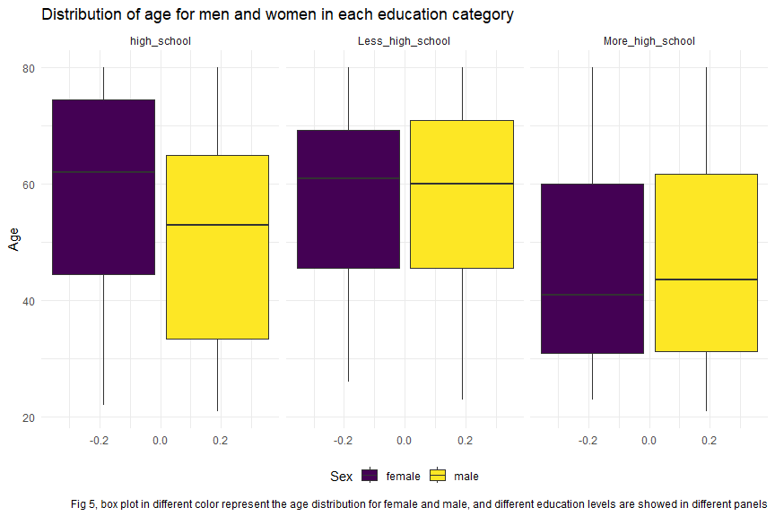
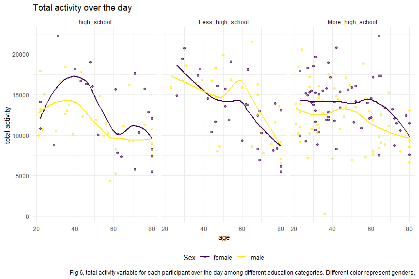
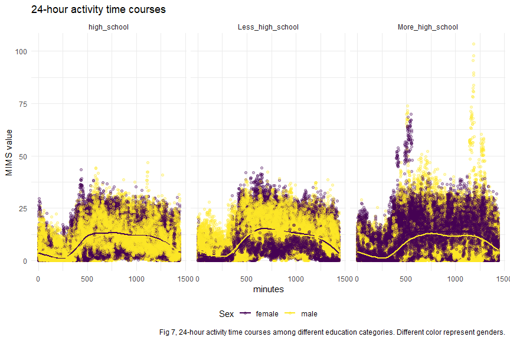

p8105_hw3_ps3395
================
Peng Su
2023-10-13

## Problem 1

#### Read in the data

``` r
data("instacart")

instacart = 
  instacart |> 
  as_tibble()
```

#### Answer questions about the data

This dataset contains 1384617 rows and 15 columns, with each row
resprenting a single product from an instacart order. Variables include
identifiers for user, order, and product; the order in which each
product was added to the cart. There are several order-level variables,
describing the day and time of the order, and number of days since prior
order. Then there are several item-specific variables, describing the
product name (e.g. Yogurt, Avocado), department (e.g. dairy and eggs,
produce), and aisle (e.g. yogurt, fresh fruits), and whether the item
has been ordered by this user in the past. In total, there are 39123
products found in 131209 orders from 131209 distinct users.

Below is a table summarizing the number of items ordered from aisle. In
total, there are 134 aisles, with fresh vegetables and fresh fruits
holding the most items ordered by far.

``` r
instacart |> 
  count(aisle) |> 
  arrange(desc(n))
```

    ## # A tibble: 134 × 2
    ##    aisle                              n
    ##    <chr>                          <int>
    ##  1 fresh vegetables              150609
    ##  2 fresh fruits                  150473
    ##  3 packaged vegetables fruits     78493
    ##  4 yogurt                         55240
    ##  5 packaged cheese                41699
    ##  6 water seltzer sparkling water  36617
    ##  7 milk                           32644
    ##  8 chips pretzels                 31269
    ##  9 soy lactosefree                26240
    ## 10 bread                          23635
    ## # ℹ 124 more rows

Next is a plot that shows the number of items ordered in each aisle.
Here, aisles are ordered by ascending number of items.

``` r
instacart |> 
  count(aisle) |> 
  filter(n > 10000) |> 
  mutate(aisle = fct_reorder(aisle, n)) |> 
  ggplot(aes(x = aisle, y = n)) + 
  geom_point() + 
  labs(title = "Number of items ordered in each aisle",
       caption = "Fig 1") +
  theme(axis.text.x = element_text(angle = 60, hjust = 1))
```



Our next table shows the three most popular items in aisles
`baking ingredients`, `dog food care`, and `packaged vegetables fruits`,
and includes the number of times each item is ordered in your table.

``` r
instacart |> 
  filter(aisle %in% c("baking ingredients", "dog food care", "packaged vegetables fruits")) |>
  group_by(aisle) |> 
  count(product_name) |> 
  mutate(rank = min_rank(desc(n))) |> 
  filter(rank < 4) |> 
  arrange(desc(n)) |>
  knitr::kable(caption = "Table 1")
```

| aisle                      | product_name                                  |    n | rank |
|:---------------------------|:----------------------------------------------|-----:|-----:|
| packaged vegetables fruits | Organic Baby Spinach                          | 9784 |    1 |
| packaged vegetables fruits | Organic Raspberries                           | 5546 |    2 |
| packaged vegetables fruits | Organic Blueberries                           | 4966 |    3 |
| baking ingredients         | Light Brown Sugar                             |  499 |    1 |
| baking ingredients         | Pure Baking Soda                              |  387 |    2 |
| baking ingredients         | Cane Sugar                                    |  336 |    3 |
| dog food care              | Snack Sticks Chicken & Rice Recipe Dog Treats |   30 |    1 |
| dog food care              | Organix Chicken & Brown Rice Recipe           |   28 |    2 |
| dog food care              | Small Dog Biscuits                            |   26 |    3 |

Table 1

Finally is a table showing the mean hour of the day at which Pink Lady
Apples and Coffee Ice Cream are ordered on each day of the week. This
table has been formatted in an untidy manner for human readers. Pink
Lady Apples are generally purchased slightly earlier in the day than
Coffee Ice Cream, with the exception of day 5.

``` r
instacart |>
  filter(product_name %in% c("Pink Lady Apples", "Coffee Ice Cream")) |>
  group_by(product_name, order_dow) |>
  summarize(mean_hour = mean(order_hour_of_day)) |>
  pivot_wider(
    names_from = order_dow, 
    values_from = mean_hour) |>
  knitr::kable(digits = 2,
               caption = "Table 2")
```

| product_name     |     0 |     1 |     2 |     3 |     4 |     5 |     6 |
|:-----------------|------:|------:|------:|------:|------:|------:|------:|
| Coffee Ice Cream | 13.77 | 14.32 | 15.38 | 15.32 | 15.22 | 12.26 | 13.83 |
| Pink Lady Apples | 13.44 | 11.36 | 11.70 | 14.25 | 11.55 | 12.78 | 11.94 |

Table 2

## Problem 2

#### Read in and clean the data

``` r
#getting the data
data("brfss_smart2010")

#cleaning the data
brfss_df = 
  brfss_smart2010 |>
  as_tibble() |>
  janitor::clean_names() |>
  select(
    year,
    location_state = locationabbr,
    location_county = locationdesc,
    everything()
  ) |>
  filter(
    topic == "Overall Health",
    response %in% c("Poor", "Fair", "Good", "Very good","Excellent")
  ) |>
  mutate(
    response = ordered(response,
                       levels = c("Poor", "Fair", "Good", "Very good","Excellent"))
  ) 
```

#### Using data to answer questions

##### States were observed at 7 or more locations in 2002 and 2010.

``` r
#selected the states that were observed at 7 or more locations in 2002
state_nobs_2002 = 
  brfss_df |>
  filter(
    year == 2002
  ) |>
  group_by(location_state,location_county) |>
  summarize(n_obs = n()) |>
  count(location_state, name = "n_obs") |>
  as_tibble() |>
  filter(
    n_obs >=7
  ) 

#selected the states that were observed at 7 or more locations in 2010
state_nobs_2010 = 
  brfss_df |>
  filter(
    year == 2010
  ) |>
  group_by(location_state,location_county) |>
  summarize(n_obs = n()) |>
  count(location_state, name = "n_obs") |>
  as_tibble() |>
  filter(
    n_obs >=7
  )

state_nobs_2002 |>
  knitr::kable(col.names = c("States","n_observed_locations"),
               caption = "Table 3, States that were observed at 7 or more locations in 2002")
```

| States | n_observed_locations |
|:-------|---------------------:|
| CT     |                    7 |
| FL     |                    7 |
| MA     |                    8 |
| NC     |                    7 |
| NJ     |                    8 |
| PA     |                   10 |

Table 3, States that were observed at 7 or more locations in 2002

``` r
state_nobs_2010 |>
  knitr::kable(col.names = c("States","n_observed_locations"),
               caption = "Table 4, States that were observed at 7 or more locations in 2010")
```

| States | n_observed_locations |
|:-------|---------------------:|
| CA     |                   12 |
| CO     |                    7 |
| FL     |                   41 |
| MA     |                    9 |
| MD     |                   12 |
| NC     |                   12 |
| NE     |                   10 |
| NJ     |                   19 |
| NY     |                    9 |
| OH     |                    8 |
| PA     |                    7 |
| SC     |                    7 |
| TX     |                   16 |
| WA     |                   10 |

Table 4, States that were observed at 7 or more locations in 2010

As displayed in Table 3, There were total 6 states were observed at 7 or
more locations in 2002, including CT, FL, MA, NC, NJ, PA, additionally,
in 2010, there were total 14 states that had 7 or more observing
locations, including states CA, CO, FL, MA, MD, NC, NE, NJ, NY, OH, PA,
SC, TX, WA which showed in Table 4. By comparing amount of states which
were observed with larger or equal to 7 locations in 2002 and 2010, the
over all observing locations of states might be increased.

##### Construct a dataset that is limited to “Excellent” responses, and contains, year, state, and a variable that averages the data_value across locations within a state. Make a “spaghetti” plot of this average value over time within a state (that is, make a plot showing a line for each state across years – the geom_line geometry and group aesthetic will help).

``` r
#Construct a dataset
spaghetti_df = 
brfss_df |>
  filter(
    response == "Excellent"
  ) |>
  group_by(year,location_state) |>
  mutate(
    mean_data_val = mean(data_value, na.rm = TRUE)
  ) |>
  select(year, location_state, mean_data_val) |>
  as_tibble()

#Construct spaghetti plot
spaghetti_df |>
  ggplot(aes(x = year, 
             y = mean_data_val, 
             color = as.factor(location_state))) +
  geom_line() +
  labs(x = "Year", 
       y = "Average data value",
       title = "Trand of mean data values of states",
       caption = "Fig 2, The spaghetti plot shows the trend of the average data values in different states over time. Different states are shown in different colors",
       color = "State"
       ) 
```



Fig 2. shows the trend of the average `data_values` of each state from
2002 to 2010 where different colors represent different states. It is
noticeable that the mean `data_values` in most states changed similarly
over time, while WV decreased significantly in 2005, reaching the lowest
value of 11.5

##### Make a two-panel plot showing, for the years 2006, and 2010, distribution of data_value for responses (“Poor” to “Excellent”) among locations in NY State.

``` r
#selecting fit data
distribution_df = 
  brfss_df |>
  filter(
    location_state == "NY",
    year %in% c(2006,2010)
  ) |>
  mutate(
    location_county = sub("^NY - ", "", location_county)
  ) |>
  select(year, location_state, location_county, response, data_value)

#making bar plot showing the distribution
distribution_df |>
  ggplot(aes(x = response, 
             y = data_value, 
             fill = location_county)) +
  geom_bar(stat = "identity", 
           position = "dodge") +
  labs(x = "Response", 
       y = "Data value",
       title = "Distribution of data_value among locations in NY State by bar chart",
       caption = "Fig 3, data_values of different response among different county in 2006 and 2010 are represent by bars in different colors.",
       fill = "County"
       ) +
  facet_grid(. ~ year) +
  theme(axis.text.x = element_text(angle = 60, hjust = 1))
```



``` r
#making box plot showing the distribution
distribution_df |>
  ggplot(aes(x = response, 
             y = data_value)) +
  geom_boxplot() +
  labs(x = "Response", 
       y = "Data value",
       title = "Distribution of data_value among locations in NY State by box plot",
       caption = "Fig 4, data_values among all counties are considered as a distribution of the responses, represented by a box plot, in 2006 and 2010.") +
  facet_grid(. ~ year) +
  theme(axis.text.x = element_text(angle = 60, hjust = 1))
```



Fig 3. and 4. both display the distribution of the `data_value` for
responses among locations in NY State from `Poor` to `Excellent`.

- Bar plot

In order to investigate and compare the `data_value` for 5 different
levels among different locations in NY separately, bar plot was applied
to indicate the value distribution. From Fig 3, the `data_value` in 9
counties seems to share similar distribution, where higher values are
mainly concentrated in `Good`, `Very good` and `Excellent` these three
levels. By comparing data in 2010 with 2006, it is noticeable that
`data_value` for 3 counties is only available for 2010, and the
distribution of values of the response levels in 2010 is relatively
similar to 2006, and the data-value of 2010 slightly increased in
`Very good` level compared with 2006.

- Box plot

Then the Box plot displayed the overall distribution of `data_value` at
different response levels of all counties in 2006 and 2010, by comparing
the mean values of responses, can also be found that the `data_value` of
2010 is slightly increased at the `Very good` level, which is the same
trend as shown in the bar chart.

## Problem 3

##### Load, tidy, and organize the data sets.

``` r
#read and tidy the data
demographic_df = 
  read_csv("data/nhanes_covar.csv", 
    skip = 4) |>
  janitor::clean_names() |>
  mutate(
    sex = 
      case_match(
        sex, 
        1 ~ "male", 
        2 ~ "female"),
    sex = as.factor(sex),
    education = 
      case_match(
        education,
        1 ~ "Less_high_school",
        2 ~ "high_school",
        3 ~ "More_high_school"),
    education = as.factor(education)
  ) |>
  filter(age >= 21) |>
  drop_na()

accelerometer_df = 
  read_csv("data/nhanes_accel.csv") |>
  janitor::clean_names()
```

##### Table for the number of men and women in each education category, and visualization of the age distributions for men and women in each education category.

``` r
#selection and create 2*2 table for sex and education data
demographic_df |>
  select(sex, education) |>
  janitor::tabyl(sex, education) |>
  knitr::kable(col.names = c("Sex","High school equivalent", 
                             "Less than high school", "More than high school"),
               caption = "Table 5, men and women in each education category")
```

| Sex    | High school equivalent | Less than high school | More than high school |
|:-------|-----------------------:|----------------------:|----------------------:|
| female |                     23 |                    28 |                    59 |
| male   |                     35 |                    27 |                    56 |

Table 5, men and women in each education category

Table 5 shows a 2x2 table for the number of men and women in each
education category, and regardless of gender, the number of people with
an education level above high school is higher than the other two
education categories.

``` r
#visualization of the age distributions
demographic_df |>
  ggplot(aes(y = age, 
             fill = sex)) +
  geom_boxplot() +
  labs(y = "Age",
       fill = "Sex",
       title = "Distribution of age for men and women in each education category",
       caption = "Fig 5, box plot in different color represent the age distribution for female and male, and different education levels are showed in different panels") +
  facet_grid(. ~ education)
```



Fig 5 indicates the age distributions across gender among different
education levels. From the box plot, it can be found that women have a
relatively higher age than men in high school education level, while the
age distribution is similar between the sexes in other two categories.

##### Total activity variable for each participant.

``` r
#mutate data and merge datesets
merge_df = 
  left_join(demographic_df, accelerometer_df) |>
  mutate(
    total_activity = rowSums(across(min1:min1440))
  )

#visualization
merge_df |>
  ggplot(aes(x = age, y = total_activity, color = sex)) +
  geom_point(alpha = 0.6) +
  geom_smooth(se = FALSE) +
  labs(x = "age",
       y = "total activity",
       color = "Sex",
       title = "Total activity over the day",
       caption = "Fig 6, total activity variable for each participant over the day among different education categories. Different color represent genders.") +
  facet_grid(. ~ education)
```



From Fig 5, it can be noticed that the total activity declined with age
mainly for all genders and for all educational categories. At the same
time, the distribution range of total activity was similar among the
three different education levels. In addition, it can be seen from the
trend line that in the two education levels `high_school` and
`More_high_school`, the overall total activity of women in almost all
ages is relatively higher than that of men, while in the
`Less_high_school` education level, the total activity of men is lower
than that of women before the age of about 40, and the opposite is true
after 40. Furthermore, although the overall trend of total activity for
both men and women in the high category is decreasing, it experiences an
increasing process during about 20 to 40 years, and begins to decline
after 40.

##### Three-panel plot that shows the 24-hour activity time courses for each education level

``` r
merge_df |>
  pivot_longer(
    min1:min1440,
    names_to = "min",
    values_to = "MIMS") |> 
  mutate(min = sub("^min", "", min),
         min = as.numeric(min)) |>
  ggplot(aes(x = min, y = MIMS, color = sex)) +
  geom_point(alpha = 0.3) +
  geom_smooth(se = FALSE) +
  labs(x = "minutes",
       y = "MIMS value",
       color = "Sex",
       title = "24-hour activity time courses",
       caption = "Fig 7, 24-hour activity time courses among different education categories. Different color represent genders.") +
  facet_grid(. ~ education)
```



Fig 7 indicates the 24-hour activity time courses among different
education categories. Different color represent genders. From the trend
lines, it is noticeable that, the main trend of MIMS values is similar
among education levels for both gender, while the 24-hour activities for
people in “More than high school” category is relatively higher than
other education classes. Moreover, men in “More than high school” group
had significantly higher MIMS values from 1000 to 1440 minutes than
women in the same group, as well as participants in other education
levels.
